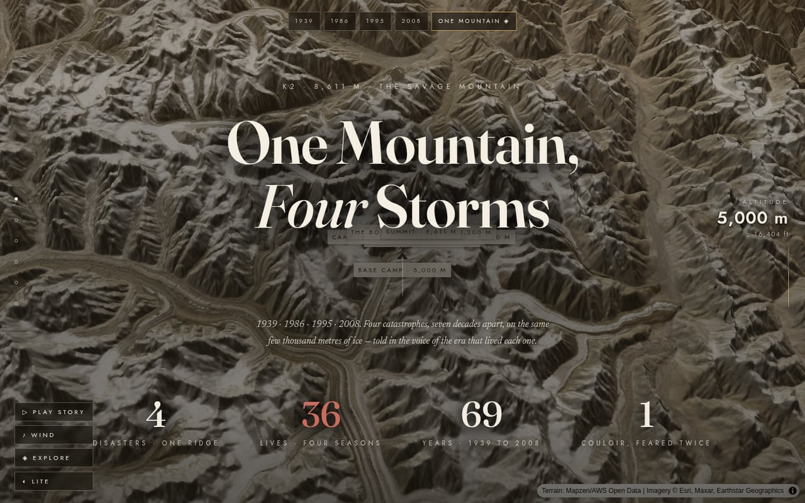
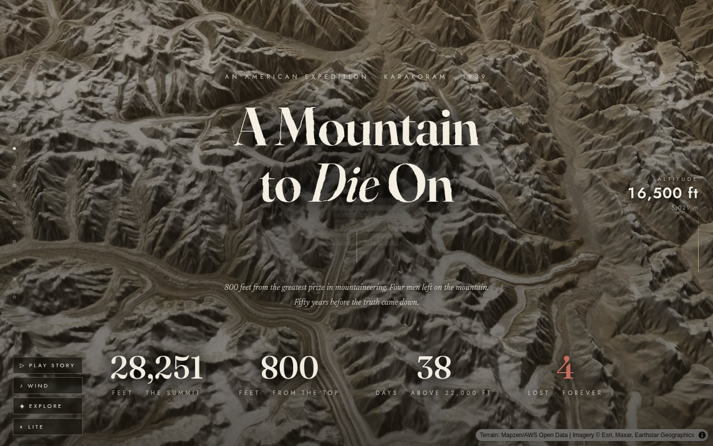
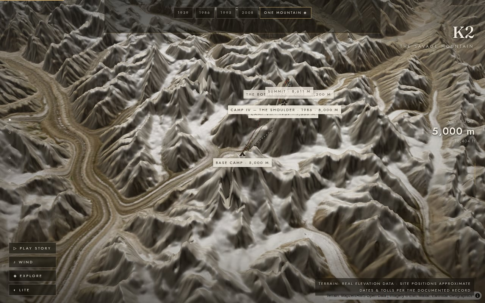
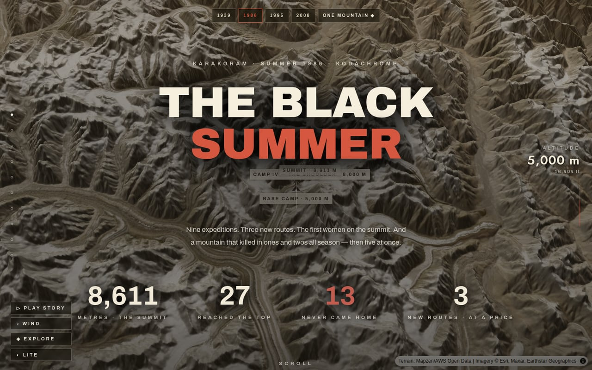
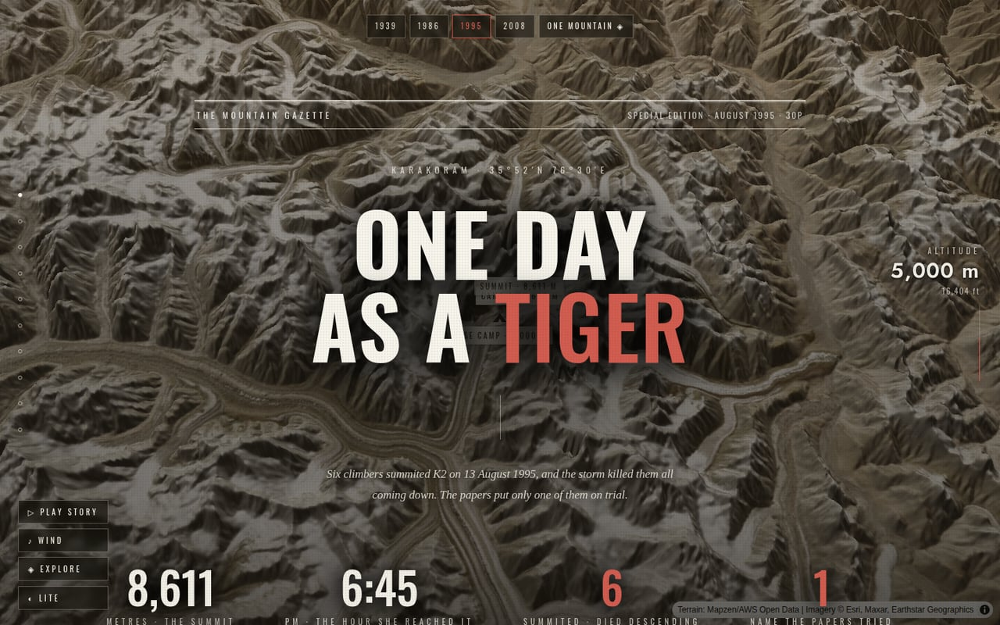
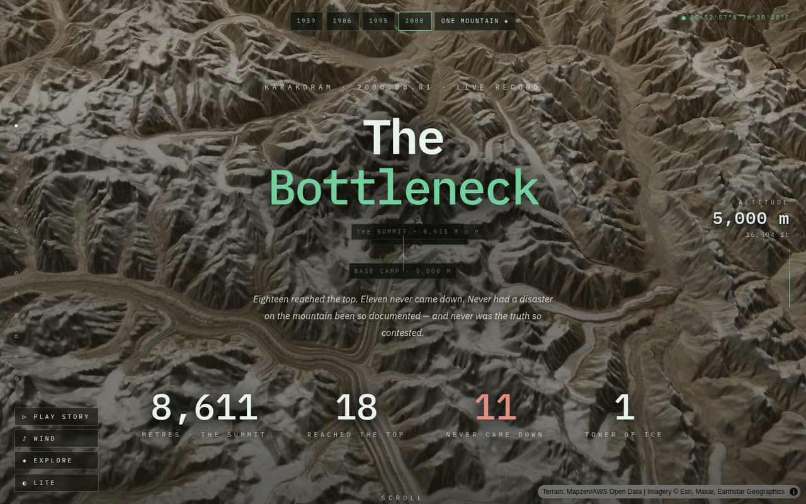
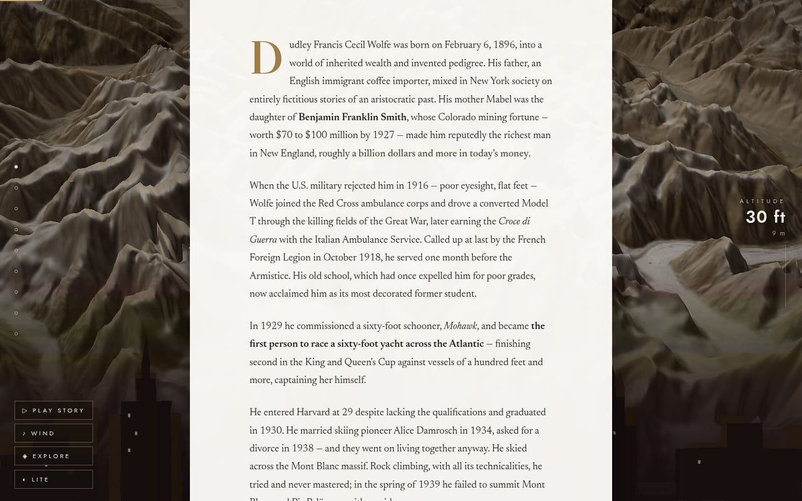
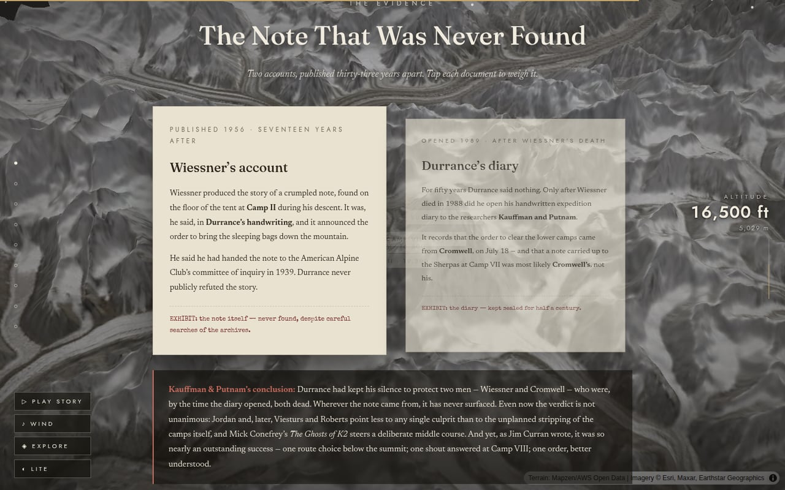
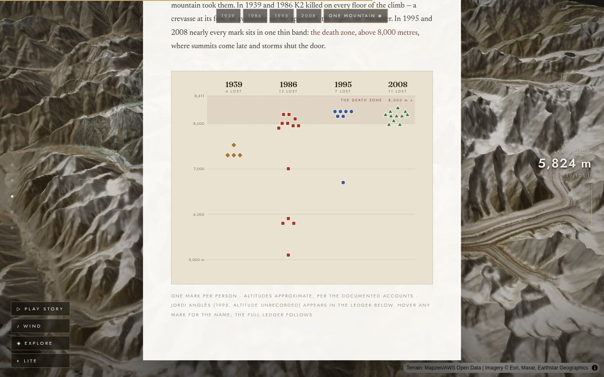

# K2 — One Mountain, Four Storms


An immersive scrollytelling site about K2's four great disasters — a real,
scroll-scrubbed 3D flight over the mountain's actual terrain, woven through
four narratives told in four different visual languages. Live at
**[k2.storytimemaps.com](https://k2.storytimemaps.com)**.

> This repository is intentionally private (see [Video clips & portraits](#video-clips--portraits)) —
> this README documents the project for the people who already have access.

## Screenshots

<table>
<tr>
<td width="33%"></td>
<td width="33%"></td>
<td width="33%"></td>
</tr>
<tr>
<td align="center"><sub><b>/</b> — the hub: century scrubber, cover cards, the death toll up front</sub></td>
<td align="center"><sub><b>/1939</b> — the original story, sealed-archive paper and real type</sub></td>
<td align="center"><sub>Real elevation data (AWS terrarium DEM) under every page, camera scroll-scrubbed along the Abruzzi Spur</sub></td>
</tr>
<tr>
<td width="33%"></td>
<td width="33%"></td>
<td width="33%"></td>
</tr>
<tr>
<td align="center"><sub><b>/1986</b> — The Black Summer: Kodachrome slide mounts, carbon-paper dispatches</sub></td>
<td align="center"><sub><b>/1995</b> — One Day as a Tiger: newsprint tabloid, teletext weather, peel-back headlines</sub></td>
<td align="center"><sub><b>/2008</b> — The Bottleneck: dark tracking dashboard, radio log, live GPS styling</sub></td>
</tr>
<tr>
<td width="33%"></td>
<td width="33%"></td>
<td width="33%"></td>
</tr>
<tr>
<td align="center"><sub>Chapter prose floats over the live map as the camera moves with it</sub></td>
<td align="center"><sub>Tap-to-flip evidence documents deliver the story's reveal — never told twice</sub></td>
<td align="center"><sub>The hub's deaths-by-altitude chart, one mark per person, hoverable</sub></td>
</tr>
</table>

## How it works

Under the chrome, every page is the same idea: a persistent **MapLibre GL
3D-terrain map** sits fixed behind the viewport (real elevation data —
AWS terrarium DEM + Esri/Maxar imagery + hillshade, no API key required),
and the prose scrolls over it in a normal document flow. As the reader
scrolls, an `IntersectionObserver`-driven scrubber walks a list of camera
**keyframes** — `[dom-id, camp, zoom, pitch, bearing, y-offset, grade]` —
each anchored to a real element in the page, so the camera arrives at Base
Camp exactly when the text talks about Base Camp. There's no video and no
pre-rendered animation; it's one live map, flown by hand-tuned keyframes,
the whole way down.

A few of the moving pieces layered on top of that spine:

- **Weather** — a shared `weather.js` engine cross-fades MapLibre sky/fog
  presets and relights the terrain per story "grade" (`g-day`, `g-storm`,
  `g-night`, `g-dusk`, `g-mourn`, `g-city`), plus a parallax canvas of
  drifting cloud banks and storm-density snow.
- **The 17-event timeline** (Chapter IV, 1939; the equivalent per-era
  timelines on the other pages) drives camp markers, climber positions, and
  a HUD altimeter in lockstep as the reader scrubs — forward or back.
- **Explore mode** turns the same map interactive: every camp becomes
  clickable, opening a location dossier whose own mini-scrubber steps
  through the same events without leaving the map.
- **Evidence documents** (screenshot above) are tap-to-flip period documents
  that deliver the story's actual reveal — deliberately held back from the
  narrative prose so it's told exactly once, in the right place.
- **Narration** reads the page aloud via the Web Speech API (no keys, no
  server), auto-scrolling block by block; a synthesized WebAudio wind
  engine tracks the story's altitude; a typewriter effect types out the
  expedition's signals record on first view.
- **The four eras look nothing alike on purpose.** 1939 is sealed-archive
  paper (Fraunces/Jost/Newsreader/Special Elite); 1986 is Kodachrome slide
  mounts and carbon-paper dispatches; 1995 is a tabloid front page with
  teletext weather and pastiche "trial" headlines; 2008 is a dark GPS
  tracking console. Same engine, four skins, one `window.__ERA` data
  contract per era page.

Every date, altitude, and quotation follows the documented historical
record — sources are cited on each page's own colophon.

## The four disasters

- `/` — **One Mountain, Four Storms**, the hub: century scrubber, four era
  cover cards, the deaths-by-altitude chart, and the full ledger of names
- `/1939` — **A Mountain to Die On**, the original page: an American
  expedition 800 feet from the summit, four men lost, fifty years before
  the truth came down
- `/1986` — **The Black Summer**: nine expeditions, three new routes, the
  first women on the summit — and thirteen who never came home
- `/1995` — **One Day as a Tiger**: six climbers summited on 13 August 1995;
  the storm killed them all coming down
- `/2008` — **The Bottleneck**: eighteen reached the top, eleven never came
  down — the most documented disaster on the mountain, and the most
  contested

`/disasters` permanently redirects to `/` (`vercel.json`).

Era pages share `public/js/era-{map,chrome,extras}.js` — a parameterized
sibling of the 1939 engine/chrome/extras, driven by a `window.__ERA` config
inside each `app/<year>/story.html` — and re-skin `main.css` with
`public/css/era*.css` / `disasters.css`.

## Architecture

A lean Next.js (App Router, static export) wrapper around a deliberately
plain static story — the story markup is never React-ified:

- `app/1939/story.html`, `app/hub.html`, `app/<year>/story.html` — the
  entire markup for each page, **verbatim HTML** (including classic
  `<script>` tags), injected untouched via `dangerouslySetInnerHTML` inside
  a `display: contents` wrapper. The browser parses and runs it exactly
  like a single-file page — scripts run synchronously, in order, before
  React hydrates, and hydration never touches the injected subtree.
- `app/layout.tsx`, `app/*/page.tsx` — head only: title/OG metadata,
  favicon, font + stylesheet links (React 19 `precedence` hoisting). No
  client components wrap the story.
- `public/css/main.css` + `public/css/era*.css`/`disasters.css` — the
  styles, plain files served as-is.
- `public/js/{weather,engine,chrome,extras}.js` + the `era-*` siblings —
  the story's behavior: classic-script IIFEs that communicate only through
  guarded `window.__*` globals. Load order (weather → engine/map → chrome
  → extras) matters.
- `public/clips/` — local video excerpts, gitignored (see below).

`next build` emits a fully static site to `out/` — no server runtime, no
API routes.

## Running

```sh
pnpm install
pnpm dev        # http://localhost:3000
pnpm build      # static export to out/
pnpm preview    # serve out/ (production-equivalent)
```

## Deployment — k2.storytimemaps.com

Deploy on Vercel via the git integration: push to `main` → automatic
production deploy. The domain is attached to the `k2-storytimemaps` project;
DNS lives at the domain's third-party DNS host.

## Video clips & portraits

The nine `.mp4` excerpts in `public/clips/` are excerpts of other people's
documentaries, committed and served publicly as short, credited excerpts in
a transformative historical narrative (owner's decision — see the copyright
rule in `CLAUDE.md`). **This is why the repo must stay private.** Regenerate
them from the two source videos with `scripts/make-clips.sh` (see
`public/clips/README.md`). If they're ever removed, the page still works —
the film frames stay black.

Expedition portraits live in `public/img/` (Jack Durrance Collection /
American Alpine Club, and Wolfe's 1919 passport photograph); every image
keeps its credit in the cast cards and colophon. Era-page imagery is
freely licensed photography (public domain / CC via Wikimedia Commons,
credited on-page) plus reserved film frames under the same posture as the
1939 clips.

## Browser expectations

- **WebGL required** for the 3D terrain. If the map fails, a static
  photograph fallback (`#bgFallback`) appears instead and the story remains
  readable.
- **Lite mode** (the "◐ Lite" button) turns off hillshading, lowers terrain
  exaggeration and pixel ratio, and hides snow — for weak GPUs.
- `prefers-reduced-motion` disables animations, particles, marker lerping,
  and the typewriter effect.

## Smoke checklist

<details>
<summary>After any structural change, run <code>pnpm build && pnpm preview</code> and go through this list (current behavior is the spec).</summary>

**1939** (`app/1939/story.html`):

- [ ] Terrain loads behind the loading veil ("Raising the mountain" fades out)
- [ ] Camera scrubs on scroll, smoothly, in **both** directions
- [ ] All 17 timeline steps (Ch IV) update markers, HUD, and scrubber
- [ ] Camp states flip at the **July 20–21** step (Camps I–IV, VI–VII turn
      red/struck; V, VIII, IX dim at July 22)
- [ ] Vignettes appear: NYC skyline in Ch I, the fall at July 22, the lone
      tent in Ch VI (also: haul at Jun 30, pair in Ch V, porters at Jul 20–21,
      rescue at Jul 28–29)
- [ ] All 9 videos autoplay muted when scrolled into view; each "Sound on"
      button unmutes its own clip; letterbox bars appear while a clip is visible
- [ ] Wind toggle ("♪ Wind") starts/stops the wind; level follows altitude
- [ ] "▷ Play story" narrates the text aloud and auto-scrolls block by
      block; pressing again (or entering explore) stops it
- [ ] Explore mode enters (map becomes interactive, story fades) and exits
      cleanly (scroll camera resumes where you are)
- [ ] Explore location cards: camps are clickable; the card opens with the
      camp's record, its scrubber steps the 17 events (climbers, camp
      states, and progress line follow), and closing it — or exiting
      explore — restores the story state
- [ ] Evidence documents flip front/back on tap
- [ ] The expedition record panel types itself on first view
- [ ] Memorial night: stars fade in, the Gilkey flame marker appears
- [ ] Lite toggles hillshade off (terrain visibly flattens in shading)
- [ ] With reduced motion enabled, animations/particles/typewriter are off
- [ ] Browser console shows no hydration errors or React warnings

**Era pages and the hub** (`/`, `/1986`, `/1995`, `/2008`):

- [ ] Terrain loads on each page; loading veil fades
- [ ] Camera scrubs through each page's keyframes in both directions
- [ ] The timeline zone drives markers, HUD, and scrubber on each page
- [ ] Explore mode: sites clickable, location card scrubber steps that
      page's events, exit restores the story
- [ ] 1995: teletext panels render; the four "trial" headlines peel on tap
- [ ] 2008: radio log types itself; the three evidence files bring forward
- [ ] 1986: typed dispatches type; slide-mount diagrams render
- [ ] `/` (hub): century steps drive the pins; altitude chart marks show
      name tooltips; cover cards link to all four stories; `/disasters`
      redirects to `/`
- [ ] Era media: Commons figures load with credits; film frames show the
      era-styled "reel pending" state while clips are absent
- [ ] `.epochs` block on the 1939 page links to the three era pages + hub
- [ ] Era switcher (`.eranav`) present on era pages and hidden in explore

</details>

---

<sub>Screenshots regenerated with the <code>readme-screenshots</code> skill in
<code>.claude/skills/</code> — see there to refresh them after a visual change.</sub>
